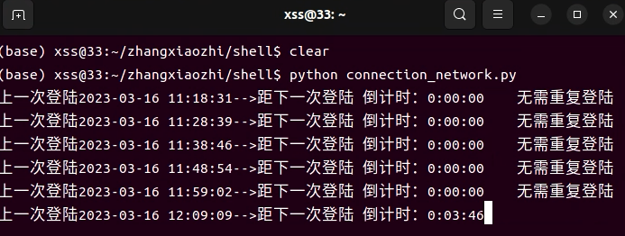

# auto_login_wtu
基于seleninum+google+tmux的自动登录校园网（WTU）

## 1. 版本
- Ubuntu `22.04` (不作要求)
- google浏览器    `111.0.5563.64（正式版本） （64 位）`
- chromedriver_linux64    `111.0.5563.64` (已经提供文件)
- selenium  `4.2.0`
- tmux  `3.2a`(这个版本不作要求)

## 2. 使用
1. 安装tmux`(目的是为了让python程序在后台永久执行，即使关闭了终端窗口，只要不重启服务器)`
    ```
    sudo apt-get install tmux
    ```
2. 新建session
    ```
    tmux new -s connection_network
    ```
3. 接入session
    ```
    tmux attach -t connection_network
    ```
4. 安装selenium
   ```
   pip install selenium==4.2.0
   ```
5. 运行python程序`(先配置py文件，再运行)` 
    ```
    python connection_network.py
    ```

## 3.效果
<div align=center>
    
</div>


https://user-images.githubusercontent.com/55654554/225511120-fca2a81e-5fdb-4255-ad14-0b05a2d8c0dd.mp4


  
